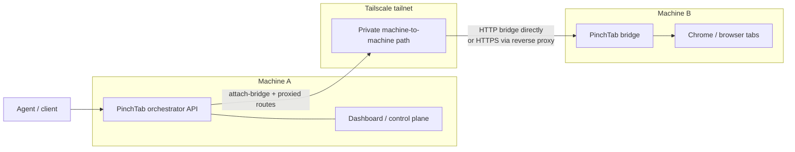

# A Tailscale Bridge Story: One Orchestrator, Remote Browsers

There is a simple distributed PinchTab shape that turns out to be very practical:

- machine A runs the PinchTab orchestrator and dashboard
- machine B runs a PinchTab bridge
- both machines are connected through Tailscale
- agents keep talking to machine A
- browser work actually happens on machine B

That gives you one control plane and multiple places where browser execution can live.




This post walks through the exact setup, the mistakes that are easy to make, and the key distinction between `http` and `https` when attaching a remote bridge.

## Scenarios

There are several practical ways to use this setup.

### Shared Browser Host

- machine A runs the orchestrator and dashboard
- machine B runs one or more headed bridges
- users and agents keep talking to machine A
- the real browser windows live on machine B

This is the easiest way to centralize browser execution without forcing every user to run Chrome locally.

### Personal Control Plane, Remote Worker

- a developer keeps the orchestrator on their own machine
- a second machine runs the bridge with more CPU, RAM, or a better browser environment
- browser work moves off the local laptop or desktop, but control stays local

This is useful when you want the UI and control loop close to you, but the heavy browser work somewhere else.

### Region-Local Execution

- machine A is the main control plane
- machine B is closer to the target websites, APIs, or internal network
- the orchestrator attaches the bridge and routes browser work there

This is useful when latency, geography, or network placement matters more than where the operator is sitting.

### Dedicated Automation Node

- one bridge machine is reserved for scraping, PDF generation, screenshots, or long-running automation
- the orchestrator attaches it as a normal instance
- clients still use the same API surface on machine A

This keeps automation-specific browser load off the main orchestrator machine.

### Headed Browser Pool Across A Tailnet

- several machines on the tailnet each run a bridge
- one orchestrator attaches them
- the orchestrator becomes the single control surface for a small remote browser fleet

This gives you a lightweight distributed browser setup without adding a full remote execution platform.

### HTTPS Fronted Remote Bridge

- machine B runs a bridge
- a reverse proxy or Tailscale Serve terminates TLS in front of it
- the orchestrator attaches the bridge through an `https://` origin

This is useful when you want the remote bridge reachable as a normal TLS endpoint instead of a raw HTTP port.

One thing all of these scenarios share:

- the orchestrator attaches to an already running bridge
- it does not remotely start the process on machine B

## The Mental Model

The control path looks like this:

```text
agent -> orchestrator on machine A -> bridge on machine B -> browser on machine B
```

The orchestrator does not SSH into the remote machine and does not launch the remote process. It simply attaches to an already running PinchTab bridge with:

```text
POST /instances/attach-bridge
```

Once attached, the orchestrator proxies normal instance and tab routes to that bridge.

That means:

- clients only need to know machine A
- machine A needs to be able to reach machine B
- machine B needs to expose a bridge origin that machine A can call

## Why Tailscale Works Well

Tailscale is a good fit for this model because you do not need to publish the bridge to the public internet.

You do need the bridge to be reachable inside the tailnet, which means:

- the bridge must not be bound only to `127.0.0.1`
- the remote machine must allow inbound traffic on the chosen bridge port from Tailscale peers
- the orchestrator must use the bridge's Tailscale IP or MagicDNS hostname

No normal WAN port forwarding is required.

## Step 1: Start The Bridge On Machine B

On machine B, configure and start the bridge so it listens on a Tailscale-reachable address:

```bash
# Configure for network access
pinchtab config set server.bind 0.0.0.0
pinchtab config set server.port 9867
pinchtab config set server.token bridge-secret-token

# Start the bridge
pinchtab bridge
```

This non-loopback bind is a documented, non-default, security-reducing deployment change. It is appropriate here only because the bridge is intended to be reachable on your tailnet. Keep the bridge token set and do not publish the port beyond that controlled network boundary.

If you are using a daemon or service manager, ensure the config file has `bind: "0.0.0.0"`.

The first common mistake is to leave the bridge on the default localhost bind. When that happens:

- `curl http://127.0.0.1:9867/health` works on machine B
- `curl http://machine-b.tailnet.ts.net:9867/health` fails from machine A

That is not an auth failure. It means the bridge is only listening on localhost.

## Step 2: Prove Machine A Can Reach Machine B

Before attaching anything, verify the bridge directly from machine A:

```bash
curl -H "Authorization: Bearer bridge-secret-token" \
  http://machine-b.tailnet.ts.net:9867/health
```

If this fails, stop there and fix connectivity first.

Useful interpretations:

- `Connection refused`
  - machine A can reach machine B, but nothing is listening on that port
  - usually wrong port or localhost-only bind on machine B
- `401 unauthorized`
  - connectivity is correct, but the token is wrong or missing
- `200 OK`
  - the bridge is reachable and ready to attach

## Step 3: Configure The Orchestrator On Machine A

Remote bridge attachment is governed by the orchestrator's existing attach policy:

```json
{
  "security": {
    "attach": {
      "enabled": true,
      "allowHosts": [
        "machine-b.tailnet.ts.net"
      ],
      "allowSchemes": [
        "ws",
        "wss",
        "http",
        "https"
      ]
    }
  }
}
```

Important details:

- `allowHosts` must contain the exact hostname or IP you plan to use in `baseUrl`
- `allowSchemes` must include `http` or `https` for `attach-bridge`
- `ws` and `wss` remain relevant for CDP attach, not bridge attach
- `baseUrl` must be a bare origin such as `https://bridge-host:9868`; do not include credentials, query strings, fragments, or a path

Using `allowHosts: ["*"]` is a documented, non-default, security-reducing override. It disables host validation and allows attachment to any reachable bridge host with an allowed scheme. Use it only on isolated, operator-controlled networks.

The second common mistake is to accidentally configure `allowHosts` as one comma-separated string instead of a real JSON array. It must be:

```json
["machine-b.tailnet.ts.net", "machine-c.tailnet.ts.net"]
```

not:

```json
["machine-b.tailnet.ts.net,machine-c.tailnet.ts.net"]
```

After changing config, restart the orchestrator daemon on machine A.

## Step 4: Attach The Bridge

Once direct health checks work from machine A, attach the bridge to the orchestrator:

```bash
curl -X POST http://127.0.0.1:9867/instances/attach-bridge \
  -H "Authorization: Bearer orchestrator-token" \
  -H "Content-Type: application/json" \
  -d '{
    "name": "machine-b-bridge",
    "baseUrl": "http://machine-b.tailnet.ts.net:9867",
    "token": "bridge-secret-token"
  }'
```

Expected response shape:

```json
{
  "id": "inst_0a89a5bb",
  "profileId": "prof_278be873",
  "profileName": "machine-b-bridge",
  "port": "",
  "url": "http://machine-b.tailnet.ts.net:9867",
  "status": "running",
  "attached": true,
  "attachType": "bridge"
}
```

That tells you the orchestrator registered a running attached bridge instance and will now route traffic to it.

## Step 5: Control The Remote Browser From Machine A

After attachment, clients keep talking only to the orchestrator on machine A.

List instances:

```bash
curl -H "Authorization: Bearer orchestrator-token" \
  http://127.0.0.1:9867/instances
```

Open a tab on the remote bridge:

```bash
curl -X POST http://127.0.0.1:9867/instances/<instanceId>/tabs/open \
  -H "Authorization: Bearer orchestrator-token" \
  -H "Content-Type: application/json" \
  -d '{"url":"https://example.com"}'
```

Read a tab through the orchestrator:

```bash
curl -H "Authorization: Bearer orchestrator-token" \
  http://127.0.0.1:9867/tabs/<tabId>/text?format=text
```

This is the key operational benefit: the work is happening remotely, but the control point stays local and centralized.

## HTTP Versus HTTPS

This is the part that causes the most confusion.

### Direct Bridge Port: Usually HTTP

If you start the bridge with `bind: 0.0.0.0` and `port: 9867` in your config:

```bash
pinchtab bridge
```

the bridge itself is usually speaking plain HTTP on that port.

That means this can work:

```bash
http://machine-b.tailnet.ts.net:9867/health
```

while this fails:

```bash
https://machine-b.tailnet.ts.net:9867/health
```

If you point `curl` at `https://...:9867` and get a TLS protocol error, that means you are speaking HTTPS to an HTTP listener.

### HTTPS Is Supported For Attachment

The orchestrator does support attaching to an `https` bridge origin.

But that only makes sense if there is actually a TLS endpoint in front of the bridge, for example:

- Caddy
- Nginx
- Traefik
- Tailscale Serve or Funnel

In that setup, the shape is:

```text
https://machine-b.tailnet.ts.net  ->  http://127.0.0.1:9867
```

Then the attach request should use:

```json
"baseUrl": "https://machine-b.tailnet.ts.net"
```

So the rule is:

- direct bridge port: usually `http://host:port`
- reverse-proxied TLS endpoint: `https://host` or `https://host:port`

## Two Separate Tokens

There are two auth hops in this architecture:

1. client to orchestrator
2. orchestrator to bridge

That means you can use different tokens:

- users and agents send the orchestrator token to machine A
- machine A sends the bridge token to machine B

Clients do not need the bridge token once the bridge is attached.

## What You Gain

This setup gives you a nice operating model:

- one orchestrator can control multiple remote bridges
- browser execution can happen on different machines in the tailnet
- clients, dashboards, and agents do not need to know where each browser is running
- instance and tab routes stay consistent even when execution is remote

That is the real value of remote bridge attachment: you can move browser work to the right machine without changing the control surface that agents use.

## Troubleshooting Checklist

If attachment fails, walk this list in order:

1. Can machine A reach `baseUrl/health` directly?
2. Is machine B bound to `0.0.0.0` instead of only `127.0.0.1`?
3. Is the bridge actually listening on the port you think it is?
4. Does the bridge require a token, and are you sending the right one?
5. Does machine A's `allowHosts` include the exact host you used in `baseUrl`?
6. Does machine A's `allowSchemes` include `http` or `https`?
7. Are you using `http` for a direct bridge port and `https` only for a real TLS endpoint?

Once those are correct, `attach-bridge` becomes a straightforward registration step instead of a networking puzzle.
